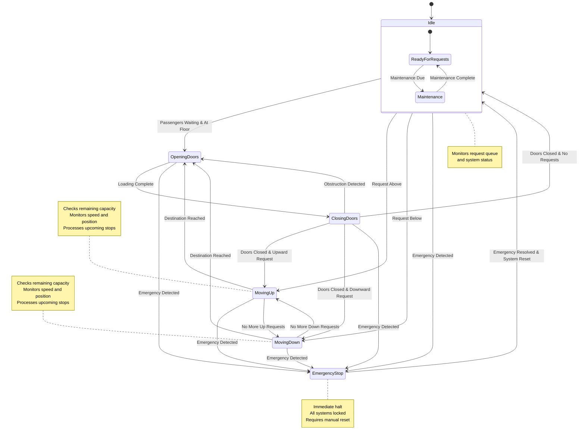

```mermaid
stateDiagram-v2
    [*] --> Idle
    
    state Idle {
        [*] --> ReadyForRequests
        ReadyForRequests --> Maintenance: Maintenance Due
        Maintenance --> ReadyForRequests: Maintenance Complete
    }
    
    Idle --> OpeningDoors: Passengers Waiting & At Floor
    Idle --> MovingUp: Request Above
    Idle --> MovingDown: Request Below
    Idle --> EmergencyStop: Emergency Detected
    
    MovingUp --> OpeningDoors: Destination Reached
    MovingUp --> EmergencyStop: Emergency Detected
    MovingUp --> MovingDown: No More Up Requests
    
    MovingDown --> OpeningDoors: Destination Reached
    MovingDown --> EmergencyStop: Emergency Detected
    MovingDown --> MovingUp: No More Down Requests
    
    OpeningDoors --> ClosingDoors: Loading Complete
    OpeningDoors --> EmergencyStop: Emergency Detected
    
    ClosingDoors --> Idle: Doors Closed & No Requests
    ClosingDoors --> MovingUp: Doors Closed & Upward Request
    ClosingDoors --> MovingDown: Doors Closed & Downward Request
    ClosingDoors --> OpeningDoors: Obstruction Detected
    ClosingDoors --> EmergencyStop: Emergency Detected
    
    EmergencyStop --> Idle: Emergency Resolved & System Reset
    
    note right of Idle
        Monitors request queue
        and system status
    end note
    
    note right of EmergencyStop
        Immediate halt
        All systems locked
        Requires manual reset
    end note
    
    note left of MovingUp
        Checks remaining capacity
        Monitors speed and position
        Processes upcoming stops
    end note
    
    note left of MovingDown
        Checks remaining capacity
        Monitors speed and position
        Processes upcoming stops
    end note
```