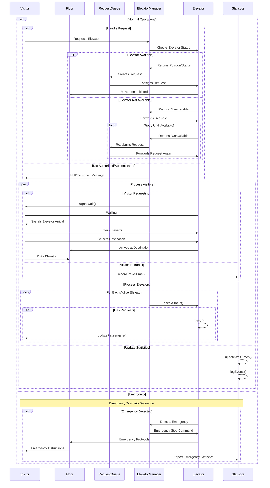

```mermaid
sequenceDiagram
    participant V as Visitor
    participant F as Floor
    participant RQ as RequestQueue
    participant EM as ElevatorManager
    participant E as Elevator
    participant Stats as Statistics

    alt Normal Operations
        alt Handle Request
            V->>EM: Requests Elevator

            EM->>E: Checks Elevator Status

            alt Elevator Available
                E->>EM: Returns Position/Status
                EM->>RQ: Creates Request
                RQ->>E: Assigns Request
                E->>F: Movement Initiated
            else Elevator Not Available
                E->>EM: Returns "Unavailable"
                RQ->>E: Forwards Request
                loop Retry Until Available
                    E->>EM: Returns "Unavailable"
                    EM->>RQ: Resubmits Request
                    RQ->>E: Forwards Request Again
                end
            end
        else Not Authorized/Authenticated
            EM->>V: Null/Exception Message 
        end
        
        par Process Visitors
            alt Visitor Requesting
                EM->>V: signalWait()
                V->>E: Waiting

                F->>V: Signals Elevator Arrival
                V->>E: Enters Elevator
                
                V->>E: Selects Destination
                E->>F: Arrives at Destination
                V->>F: Exits Elevator
            else Visitor In Transit
                V->>Stats: recordTravelTime()
            end
        
        and Process Elevators
            loop For Each Active Elevator
                EM->>E: checkStatus()
                alt Has Requests
                    E->>E: move()
                    E->>V: updatePassengers()
                end
            end
        
        and Update Statistics
            Stats->>Stats: updateWaitTimes()
            Stats->>Stats: logEvents()
        end
        
        else Emergency
        Note over V,Stats: Emergency Scenario Sequence
        alt Emergency Detected
            E->>EM: Detects Emergency
            EM->>E: Emergency Stop Command
            E->>F: Emergency Protocols
            F->>V: Emergency Instructions
            EM->>Stats: Report Emergency Statistics
        end
    end
```