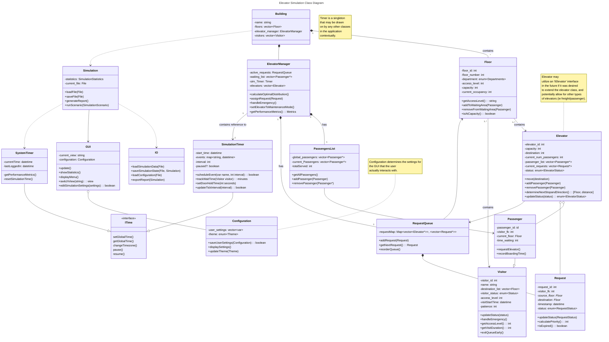

```mermaid
---
title: Elevator Simulation Class Diagram
---
classDiagram
    class Building {
        -name: string
        -floors: vector~Floor~
        -elevator_manager: ElevatorManager
        -visitors: vector~Visitor~
    }

    class Configuration {
        -user_settings: vector~var~
        -theme: enum~Theme~
        +saveUserSettings(Configuration): boolean
        +displaySettings()
        +updateTheme(Theme)
    }
    note for Configuration "Configuration determines the settings for
    the GUI that the user
    actually interacts with."    


    class Elevator {
        -elevator_id: int
        -capacity: int
        -destination: int
        -current_num_passengers: int
        -passenger_list: vector~Passenger*~
        -current_requests: vector~Request*~
        -status: enum~ElevatorStatus~
        +move(destination)
        +addPassenger(Passenger)
        +removePassenger(Passenger)
        +determineNextStopandDirection(): [Floor, distance]
        +updateStatus(status): enum~ElevatorStatus~
    }
    
    class ElevatorManager {
        -active_requests: RequestQueue
        -waiting_list: vector~Passenger*~
        -sim_Timer: Timer
        -elevators: vector~Elevator~
        +calculateOptimalDistribution()
        +assignRequest(Request)
        +handleEmergency()
        +setElevatorToMaintenanceMode()
        +getPerformanceMetrics(): Metrics
    }
    note for Elevator "Elevator may 
    utilize an 'IElevator' interface
    in the future if it was desired
    to extend the elevator class, and
    potentially allow for other types
    of elevators (ie freight/passenger)."

    class Floor {
        -floor_id: int
        -floor_number: int
        -department: enum~Departments~
        -access_level: int
        -capacity: int
        -current_occupancy: int
        +getAccessLevel(): string
        +addToWaitingArea(Passenger)
        +removeFromWaitingArea(Passenger)
        +isAtCapacity(): boolean
    }
    
    class GUI {
        -current_view: string
        -configuration: Configuration
        +update()
        +showStatistics()
        +displayMenu()
        +switchView(string): view
        +editSimulationSettings(settings): boolean
    }

    class IO {
        +loadSimulationData(File)
        +saveSimulationState(File, Simulation)
        +loadConfiguration(File)
        +exportReport(Simulation)
    }   

    class Passenger {
        -passenger_id: id
        -visitor_fk: int
        -current_floor: Floor
        -time_waiting: int
        +requestElevator()
        +recordBoardingTime()
    }

    class PassengersList {
        -global_passengers: vector~Passenger*~
        -current_Passengers: vector~Passenger*~
        -totalServed: int
        +getAllPassengers()
        +addPassenger(Passenger)
        +removePassenger(Passenger*)
    }
    
    class Request {
        -request_id: int
        -visitor_fk: int
        -source_floor: Floor*
        -destination: Floor*
        -timestamp: datetime
        -status: enum~RequestStatus~
        +updateStatus(RequestStatus)
        +calculatePriority(): int
        +isExpired(): boolean
    }

    class RequestQueue {
        -requestMap: Map~vector~Elevator*~~, ~vector~Request*~~
        +addRequest(Request)
        +getNextRequest(): Request
        +reorderQueue()
    }    

    class Simulation {
        -statistics: SimulationStatistics
        -current_file: File
        +loadFile(File)
        +saveFile(File)
        +generateReport()
        +runScenario(SimulationScenario)
    }

    class ITime 
    <<interface>> ITime 
    ITime : setGlobalTime()
    ITime : getGlobalTime()
    ITime : changeTimezone()
    ITime : pause()
    ITime : resume()

    class SystemTimer {
        -currentTime: datetime
        -lastLoggedIn: datetime
        -getPerformanceMetrics()
        -resetSimulationTime()
    }

    class SimulationTimer {
        -start_time: datetime
        -events: map~string, datetime~
        -interval: int
        -paused?: boolean
        +scheduleEvent(var name, int interval): boolean
        +trackWaitTime(Visitor visitor): minutes
        +setDoorHoldTime(int seconds)
        +updateTickInterval(interval): boolean
    }
    note for ServicesTimer "Timer is a singleton 
    that may be drawn 
    on by any other classes
    in the application 
    contextually."

    class Visitor {
        -visitor_id: int
        -name: string
        -destination_list: vector~Floor~
        -visitor_status: enum~Status~
        -access_level: int
        -visitStartTime: datetime
        -patience: int
        +updateStatus(status)
        +handleEmergency()
        +getAccessLevel(): int
        +getVisitDuration(): int
        +exitQueueEarly()
    } 
    
    Building "1" *-- "*" Floor : contains
    Building *-- ElevatorManager
    Building ..> Simulation
    Elevator o-- Passenger
    Elevator o-- Request
    Elevator --> RequestQueue
    ElevatorManager "1" *-- "1" PassengersList : has
    ElevatorManager "1" *-- "1" RequestQueue : has
    ElevatorManager "1" --> "1" SimulationTimer : contains reference to
    Floor "1..*" --> Elevator : contains
    Floor "1..*" --> Visitor : contains
    GUI o-- Configuration
    Passenger --|> Visitor
    PassengersList --> Passenger
    RequestQueue --> Floor
    RequestQueue *-- Request
    SimulationTimer --|> ITime
    Simulation ..> IO
    Simulation --> GUI
    Simulation ..> SystemTimer
    SystemTimer --|> ITime
```