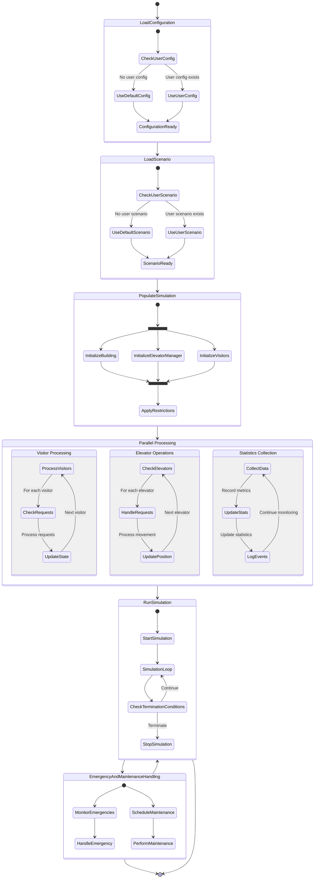

```mermaid
stateDiagram-v2
    [*] --> LoadConfiguration
    state LoadConfiguration {
        [*] --> CheckUserConfig
        CheckUserConfig --> UseDefaultConfig : No user config
        CheckUserConfig --> UseUserConfig : User config exists
        UseDefaultConfig --> ConfigurationReady
        UseUserConfig --> ConfigurationReady
    }

    state LoadScenario {
        [*] --> CheckUserScenario
        CheckUserScenario --> UseDefaultScenario : No user scenario
        CheckUserScenario --> UseUserScenario : User scenario exists
        UseDefaultScenario --> ScenarioReady
        UseUserScenario --> ScenarioReady
    }

    LoadConfiguration --> LoadScenario
    
    state PopulateSimulation {
        state fork_state <<fork>>
        state join_state <<join>>
        
        [*] --> fork_state
        fork_state --> InitializeBuilding
        fork_state --> InitializeElevatorManager
        fork_state --> InitializeVisitors
        
        InitializeBuilding --> join_state
        InitializeElevatorManager --> join_state
        InitializeVisitors --> join_state
        
        join_state --> ApplyRestrictions
    }
    LoadScenario --> PopulateSimulation
    
    state "Parallel Processing" as Parallel {
        state "Visitor Processing" as visitors {
            ProcessVisitors --> CheckRequests: For each visitor
            CheckRequests --> UpdateState: Process requests
            UpdateState --> ProcessVisitors: Next visitor
        }
        state "Elevator Operations" as elevators {
            CheckElevators --> HandleRequests: For each elevator
            HandleRequests --> UpdatePosition: Process movement
            UpdatePosition --> CheckElevators: Next elevator
        }
        state "Statistics Collection" as stats {
            CollectData --> UpdateStats: Record metrics
            UpdateStats --> LogEvents: Update statistics
            LogEvents --> CollectData: Continue monitoring
        }
    }
    PopulateSimulation --> Parallel

    state RunSimulation {
        [*] --> StartSimulation
        StartSimulation --> SimulationLoop
        SimulationLoop --> CheckTerminationConditions
        CheckTerminationConditions --> SimulationLoop : Continue
        CheckTerminationConditions --> StopSimulation : Terminate
    }
    Parallel --> RunSimulation
    
    state EmergencyAndMaintenanceHandling {
        [*] --> MonitorEmergencies
        [*] --> ScheduleMaintenance
        MonitorEmergencies --> HandleEmergency
        ScheduleMaintenance --> PerformMaintenance
    }

    RunSimulation --> EmergencyAndMaintenanceHandling
    
    EmergencyAndMaintenanceHandling --> RunSimulation
    EmergencyAndMaintenanceHandling --> [*]
    RunSimulation --> [*]
```