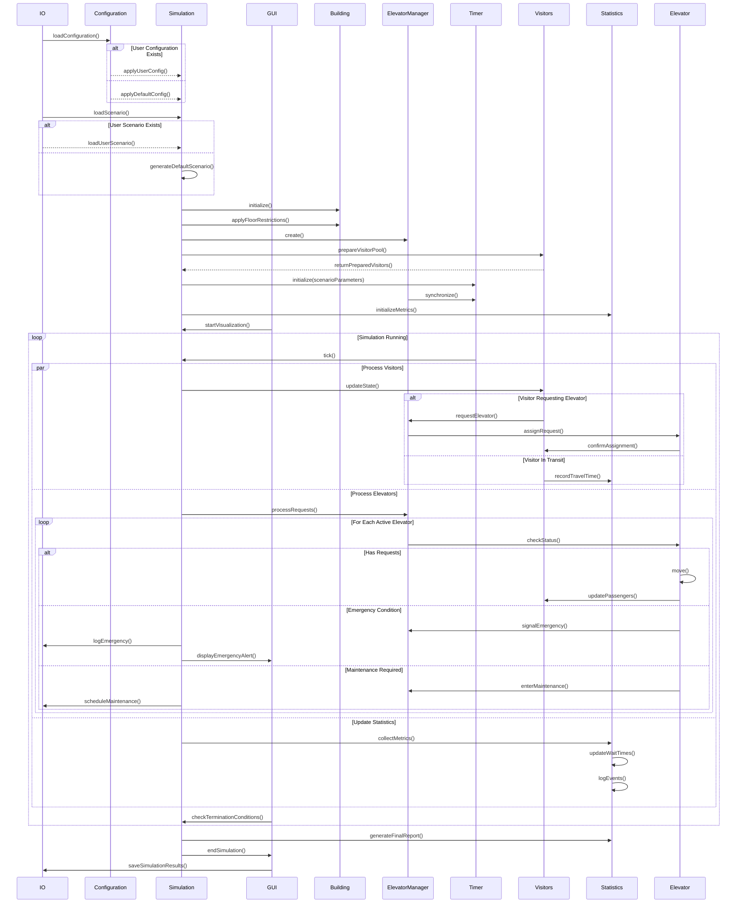

```mermaid
sequenceDiagram
    participant IO as IO
    participant Config as Configuration
    participant Simulation as Simulation
    participant GUI as GUI
    participant Building as Building
    participant ElevatorManager as ElevatorManager
    participant Time as Timer
    participant Visitors as Visitors
    participant Statistics as Statistics
    participant Elevator as Elevator
   
    #Initialization Phase
    IO->>Config: loadConfiguration()
    alt User Configuration Exists
        Config-->>Simulation: applyUserConfig()
    else
        Config-->>Simulation: applyDefaultConfig()
    end
    
    IO->>Simulation: loadScenario()
    alt User Scenario Exists
        IO-->>Simulation: loadUserScenario()
    else
        Simulation->>Simulation: generateDefaultScenario()
    end
    
    #System Setup
    Simulation->>Building: initialize()
    Simulation->>Building: applyFloorRestrictions()
    Simulation->>ElevatorManager: create()
    Simulation->>Visitors: prepareVisitorPool()
    Visitors-->>Simulation: returnPreparedVisitors()
    
    #Timer and Global Setup
    Simulation->>Time: initialize(scenarioParameters)
    ElevatorManager->>Time: synchronize()
    
    Simulation->>Statistics: initializeMetrics()
    
    #Visualization Preparation
    GUI->>Simulation: startVisualization()
   
    #Simulation Run Sequence
    loop Simulation Running
        Time->>Simulation: tick()
        
        par Process Visitors
            Simulation->>Visitors: updateState()
            alt Visitor Requesting Elevator
                Visitors->>ElevatorManager: requestElevator()
                ElevatorManager->>Elevator: assignRequest()
                Elevator->>Visitors: confirmAssignment()
            else Visitor In Transit
                Visitors->>Statistics: recordTravelTime()
            end
       
        and Process Elevators
            Simulation->>ElevatorManager: processRequests()
            loop For Each Active Elevator
                ElevatorManager->>Elevator: checkStatus()
                alt Has Requests
                    Elevator->>Elevator: move()
                    Elevator->>Visitors: updatePassengers()
                else Emergency Condition
                    Elevator->>ElevatorManager: signalEmergency()
                    Simulation->>IO: logEmergency()
                    Simulation->>GUI: displayEmergencyAlert()
                else Maintenance Required
                    Elevator->>ElevatorManager: enterMaintenance()
                    Simulation->>IO: scheduleMaintenance()
                end
            end
       
        and Update Statistics
            Simulation->>Statistics: collectMetrics()
            Statistics->>Statistics: updateWaitTimes()
            Statistics->>Statistics: logEvents()
        end
        
        #Termination Check
        GUI->>Simulation: checkTerminationConditions()
    end
    
    #Simulation Conclusion
    Simulation->>Statistics: generateFinalReport()
    Simulation->>GUI: endSimulation()
    GUI->>IO: saveSimulationResults()
```