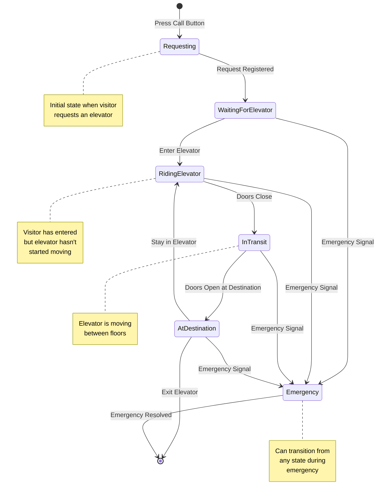

```mermaid
stateDiagram-v2
    [*] --> Requesting: Press Call Button
    
    Requesting --> WaitingForElevator: Request Registered
    note right of Requesting
        Initial state when visitor
        requests an elevator
    end note
    
    WaitingForElevator --> RidingElevator: Enter Elevator
    WaitingForElevator --> Emergency: Emergency Signal
    
    RidingElevator --> InTransit: Doors Close
    RidingElevator --> Emergency: Emergency Signal
    note right of RidingElevator
        Visitor has entered
        but elevator hasn't
        started moving
    end note
    
    InTransit --> AtDestination: Doors Open at Destination
    InTransit --> Emergency: Emergency Signal
    note right of InTransit
        Elevator is moving
        between floors
    end note
    
    AtDestination --> [*]: Exit Elevator
    AtDestination --> RidingElevator: Stay in Elevator
    AtDestination --> Emergency: Emergency Signal
    
    Emergency --> [*]: Emergency Resolved
    note right of Emergency
        Can transition from
        any state during
        emergency
    end note
```